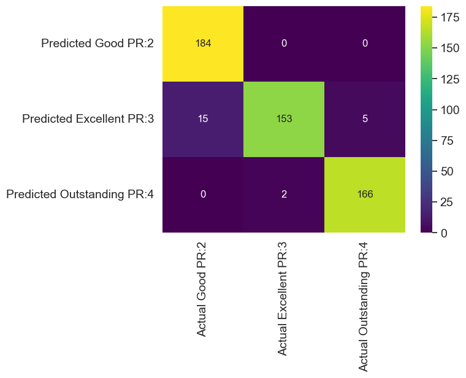

# Employee Performance Prediction 👩🏽‍💻📊  
Machine Learning Classification Project | IABAC Certified Data Scientist Program

🔗 **Live Streamlit App:**  
https://employeeperformanceanalysis-sandra.streamlit.app/

---

## 📌 Project Overview

This project builds a supervised machine learning model to predict **Employee Performance Rating** based on workplace, demographic, and engagement-related features.

The objective is to support HR and leadership teams with data-driven insights for:
- Promotion decisions
- Workforce planning
- Training optimization
- Performance improvement strategies

---

## 🧠 Business Problem

Organizations can improve productivity and retention by understanding what drives employee performance. The employee performance evaluations are often subjective and reactive.  
This project aims to:

> Predict employee performance ratings proactively using structured HR data.

By identifying key drivers of performance, organizations can intervene earlier and allocate resources more effectively.

---

## 📂 Dataset

Dataset: `INX_Future_Inc_Employee_Performance_CDS_Project2_Data_V1.8`

**Target Variable:**
- `PerformanceRating`

**Feature Categories Included:**

- 👤 Demographics (Age, Gender, MaritalStatus)
- 🏢 Role & Organizational Info (Department, JobRole, JobLevel)
- 😊 Engagement Metrics (EnvironmentSatisfaction, JobSatisfaction, RelationshipSatisfaction)
- 📈 Career Progression (YearsSinceLastPromotion, TotalWorkExperienceInYears)
- 🕒 Work Conditions (OverTime, TrainingTimesLastYear, DistanceFromHome)

---

## ⚙️ Methodology

### 1️⃣ Data Preparation
- Cleaned and validated dataset
- Encoded categorical variables (Ordinal Encoding)
- Performed train/test split

### 2️⃣ Handling Class Imbalance
- Applied oversampling techniques to improve minority class prediction

### 3️⃣ Model Development
Multiple models were tested:
- Logistic Regression
- Decision Tree
- Random Forest (Selected Model)

### 4️⃣ Final Model
**RandomForestClassifier**

Chosen due to:
- Strong generalization
- High predictive performance
- Robustness to overfitting

---

## 📊 Results

- ✅ **Test Accuracy:** ~96%
- ✅ Strong recall and precision across classes
- ✅ Limited overfitting observed (train vs test performance aligned)

Confusion matrix and classification metrics were evaluated to ensure balanced predictive performance.

  

---

## 🔍 Key Insights

- Overtime and job satisfaction significantly influence performance ratings.
- Career progression metrics (years with manager, years since last promotion) show meaningful impact.
- Engagement-related features strongly correlate with high performance.

This suggests that performance improvement strategies should focus on:
- Engagement programs
- Career progression planning
- Managerial support systems

---

## 🛠 Tech Stack

- Python
- Pandas & NumPy
- Scikit-learn
- Imbalanced-learn
- Matplotlib & Seaborn
- Streamlit (Deployment)

---

